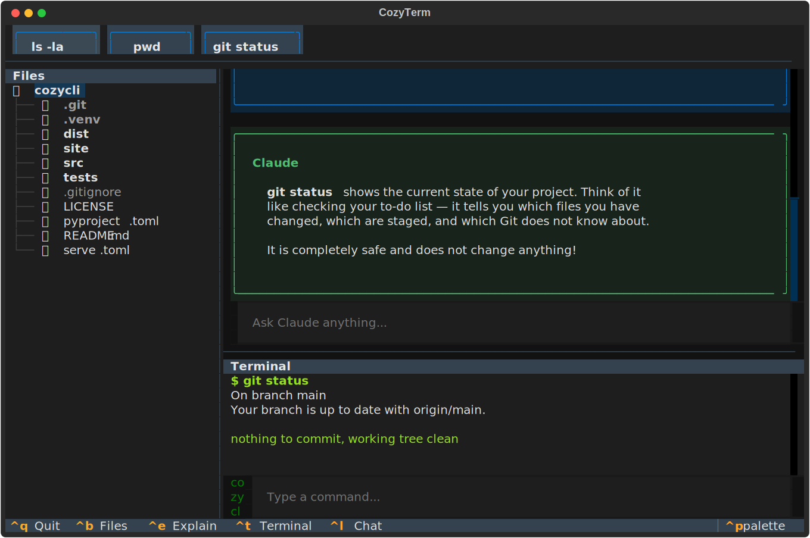

# CozyTerm

[](https://github.com/engindearing-projects/cozyterm/actions/workflows/ci.yml)
[](https://www.python.org/downloads/)
[](LICENSE)

**Your friendly terminal coach, powered by Claude.**

CozyTerm makes the terminal approachable for everyone. It wraps your shell in a three-panel TUI with an AI coach that explains commands, answers questions, and keeps you safe from destructive mistakes.

**[cozyterm.com](https://cozyterm.com)**

<p align="center">
  
</p>

## Install

```bash
pip install git+https://github.com/engindearing-projects/cozyterm.git
```

Requires Python 3.10+ and an [Anthropic API key](https://console.anthropic.com/).

```bash
export ANTHROPIC_API_KEY=sk-ant-...
cozyterm
```

## Features

- **Three-panel layout** — File browser, Claude chat, and terminal in one view
- **Auto-explain mode** — Every command gets a brief explanation (toggle with `Ctrl+E`)
- **Safety rails** — Warns before running destructive commands like `rm -rf`
- **File explorer** — Click any file to learn what it is
- **Smart suggestions** — Contextual command suggestions as clickable chips
- **Command history** — Up/down arrow to recall previous commands

## Keybindings

| Key | Action |
|-----|--------|
| `Ctrl+B` | Toggle file browser sidebar |
| `Ctrl+E` | Toggle explain mode |
| `Ctrl+T` | Focus terminal input |
| `Ctrl+L` | Focus chat input |
| `Ctrl+Q` | Quit |

## Architecture

```
src/cozyterm/
├── app.py              # Main App class, widget composition, event routing
├── styles.tcss         # Layout & styling
├── widgets/
│   ├── file_browser.py # Left sidebar - DirectoryTree
│   ├── chat_panel.py   # Center - chat messages + input
│   ├── command_panel.py# Bottom - terminal input + RichLog output
│   └── suggestion_bar.py # Top - command suggestion chips
├── claude/
│   ├── session.py      # ClaudeSession - Anthropic SDK streaming
│   ├── message_handler.py # Suggestion extraction
│   └── prompts.py      # System prompt (terminal coach persona)
├── core/
│   ├── command_runner.py # Async subprocess execution
│   └── safety.py       # Destructive command detection
└── screens/
    ├── welcome.py      # First-run onboarding
    └── safety_confirm.py # Dangerous command confirmation modal
```

Built with [Textual](https://textual.textualize.io/) and the [Anthropic Python SDK](https://github.com/anthropics/anthropic-sdk-python).

## License

MIT
